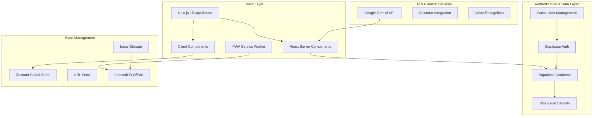

# Design Document

## Overview

AuraTask is architected as a modern, visually stunning web application inspired by clean dashboard designs with vibrant colors, interactive elements, and smooth user experiences. The application prioritizes immediate usability without barriers, featuring a beautiful three-column layout with card-based design, generous white space, and engaging hover effects that make task management feel effortless and enjoyable.

The design emphasizes clean aesthetics with rounded corners (rounded-xl to rounded-2xl), subtle shadows for depth, and vibrant accent colors (yellow highlights, blue progress indicators, green completion states). The interactive sidebar expands on hover with smooth transitions, while the main dashboard showcases prominent statistics cards with large typography and visual indicators. The application supports seamless guest-to-authenticated user flows, smart background AI processing with Gemini API, and a sophisticated multi-theme system supporting Persian (RTL) text direction.

Key design principles include never blocking the user interface, allowing navigation during background processes, and providing immediate visual feedback for all interactions. The gamified experience motivates users through beautiful visual elements, smooth animations (150-250ms with ease-out), and engaging progress indicators that make productivity tracking feel rewarding.

## Architecture

### High-Level Architecture



### Technology Stack

- **Frontend Framework**: Next.js 15.4 with App Router
- **Language**: TypeScript 5.5.3 (strict mode)
- **Database**: Supabase (PostgreSQL) with Prisma 6.12.0
- **Authentication**: Supabase Auth with Google OAuth
- **Styling**: Tailwind CSS 3.4.4 with CSS Variables
- **State Management**: Zustand for global UI state
- **Animations**: Framer Motion (primary), GSAP (complex), React Three Fiber (3D)
- **AI Integration**: Google Gemini API (server-side only)
- **Offline Support**: PWA with IndexedDB
- **UI Components**: shadcn/ui + specialized libraries

### Server-First Architecture

The application follows Next.js 15 best practices with Server Components as the default:

- **Server Components**: Data fetching, AI processing, database operations
- **Client Components**: User interactions, animations, real-time updates
- **Server Actions**: All CRUD operations, no internal API routes
- **Streaming**: Progressive loading with React Suspense
- **Caching**: Intelligent Next.js caching strategies

## Components and Interfaces

### Core Component Architecture

```typescript
// Component hierarchy and responsibilities
src/
├── app/                     # Next.js App Router
│   ├── (guest)/            # Guest user routes
│   ├── (auth)/             # Authenticated user routes
│   ├── (admin)/            # Admin dashboard routes
│   └── api/                # External API endpoints only
├── components/
│   ├── layout/             # Layout components (Server Components)
│   │   ├── AppShell.tsx    # Main application shell
│   │   ├── Sidebar.tsx     # Navigation sidebar
│   │   ├── Header.tsx      # Top header with auth
│   │   └── ContextPanel.tsx # Right contextual panel
│   ├── dashboard/          # Dashboard components (Server Components)
│   │   ├── StatsCards.tsx  # Statistics display
│   │   ├── TaskGroups.tsx  # Task group cards
│   │   └── SmartPods.tsx   # AI-powered info pods
│   ├── tasks/              # Task management (Mixed)
│   │   ├── TaskList.tsx    # Server Component
│   │   ├── TaskCard.tsx    # Server Component
│   │   ├── TaskModal.tsx   # Client Component
│   │   └── TaskForm.tsx    # Client Component
│   ├── auth/               # Authentication (Client Components)
│   │   ├── AuthButton.tsx  # Sign in/out button
│   │   ├── UserProfile.tsx # User profile display
│   │   └── GuestBanner.tsx # Subtle guest mode indicator
│   └── ui/                 # shadcn/ui components
└── lib/
    ├── actions/            # Server Actions
    ├── hooks/              # Custom React hooks
    ├── store/              # Zustand stores
    └── utils/              # Utility functions
```

### Guest User Management System

```typescript
// Guest user flow architecture
interface GuestUserFlow {
  // Immediate app access
  createTemporaryUser(): Promise<GuestUser>
  
  // Background data persistence
  syncGuestData(guestId: string, data: UserData): Promise<void>
  
  // Smart authentication
  upgradeGuestToAuth(guestId: string, authUser: AuthUser): Promise<MergedUser>
  
  // Data migration
  mergeUserData(guestData: UserData, authData: UserData): Promise<UserData>
}

// Implementation strategy
class GuestUserManager {
  async initializeGuestUser() {
    // Create anonymous user in Supabase
    const guestUser = await supabase.auth.signInAnonymously()
    
    // Store guest identifier locally
    localStorage.setItem('guest_id', guestUser.user.id)
    
    // Enable full app functionality
    return guestUser
  }
  
  async upgradeToAuthenticated(authUser: User) {
    const guestId = localStorage.getItem('guest_id')
    const guestData = await this.getGuestData(guestId)
    
    // Merge data intelligently
    await this.mergeUserData(guestData, authUser)
    
    // Clean up guest session
    await this.cleanupGuestData(guestId)
  }
}
```

### Responsive Layout System

The application uses a sophisticated responsive design that adapts to different screen sizes:

#### Desktop Layout (≥1280px)
```css
.app-shell {
  display: grid;
  grid-template-columns: 280px 1fr 320px;
  grid-template-areas: "sidebar main context";
  height: 100vh;
}

.sidebar { grid-area: sidebar; }
.main-content { grid-area: main; }
.context-panel { grid-area: context; }
```

#### Tablet Layout (≥768px)
```css
.app-shell {
  grid-template-columns: 240px 1fr;
  grid-template-areas: "sidebar main";
}

.context-panel {
  /* Merged into main content as collapsible sections */
  position: relative;
}
```

#### Mobile Layout (<768px)
```css
.app-shell {
  grid-template-columns: 1fr;
  grid-template-areas: "main";
  padding-bottom: 80px; /* Space for bottom nav */
}

.bottom-nav {
  position: fixed;
  bottom: 0;
  width: 100%;
  height: 80px;
}

.fab {
  position: fixed;
  bottom: 100px;
  right: 20px;
}
```

## Data Models

### Database Schema Design

```sql
-- Core user management with guest support
CREATE TABLE users (
  id UUID PRIMARY KEY DEFAULT gen_random_uuid(),
  email TEXT UNIQUE,
  username TEXT UNIQUE,
  avatar_url TEXT,
  is_guest BOOLEAN DEFAULT false,
  guest_upgraded_at TIMESTAMP,
  created_at TIMESTAMP DEFAULT NOW(),
  updated_at TIMESTAMP DEFAULT NOW()
);

-- Task management with AI scores
CREATE TABLE tasks (
  id UUID PRIMARY KEY DEFAULT gen_random_uuid(),
  user_id UUID REFERENCES users(id) ON DELETE CASCADE,
  title TEXT NOT NULL,
  description TEXT,
  status task_status DEFAULT 'todo',
  priority INTEGER DEFAULT 3,
  ai_importance_score DECIMAL(3,2),
  ai_urgency_score DECIMAL(3,2),
  due_date TIMESTAMP,
  completed_at TIMESTAMP,
  group_id UUID REFERENCES task_groups(id),
  parent_task_id UUID REFERENCES tasks(id),
  created_at TIMESTAMP DEFAULT NOW(),
  updated_at TIMESTAMP DEFAULT NOW()
);

-- Task groups with AI-suggested emojis
CREATE TABLE task_groups (
  id UUID PRIMARY KEY DEFAULT gen_random_uuid(),
  user_id UUID REFERENCES users(id) ON DELETE CASCADE,
  name TEXT NOT NULL,
  color TEXT NOT NULL,
  emoji TEXT,
  ai_suggested_emoji TEXT,
  created_at TIMESTAMP DEFAULT NOW()
);

-- Gamification system
CREATE TABLE user_stats (
  id UUID PRIMARY KEY DEFAULT gen_random_uuid(),
  user_id UUID REFERENCES users(id) ON DELETE CASCADE,
  aura_points INTEGER DEFAULT 0,
  current_streak INTEGER DEFAULT 0,
  longest_streak INTEGER DEFAULT 0,
  tasks_completed_today INTEGER DEFAULT 0,
  tasks_completed_total INTEGER DEFAULT 0,
  last_activity_date DATE DEFAULT CURRENT_DATE,
  updated_at TIMESTAMP DEFAULT NOW()
);

-- Collaboration features
CREATE TABLE shared_tasks (
  id UUID PRIMARY KEY DEFAULT gen_random_uuid(),
  task_id UUID REFERENCES tasks(id) ON DELETE CASCADE,
  shared_by UUID REFERENCES users(id) ON DELETE CASCADE,
  shared_with UUID REFERENCES users(id) ON DELETE CASCADE,
  permission_level TEXT DEFAULT 'view',
  created_at TIMESTAMP DEFAULT NOW()
);

-- User preferences and settings
CREATE TABLE user_preferences (
  id UUID PRIMARY KEY DEFAULT gen_random_uuid(),
  user_id UUID REFERENCES users(id) ON DELETE CASCADE,
  theme TEXT DEFAULT 'default',
  language TEXT DEFAULT 'fa',
  ai_importance_weight DECIMAL(3,2) DEFAULT 0.5,
  ai_urgency_weight DECIMAL(3,2) DEFAULT 0.5,
  notifications_enabled BOOLEAN DEFAULT true,
  leaderboard_visible BOOLEAN DEFAULT true,
  created_at TIMESTAMP DEFAULT NOW(),
  updated_at TIMESTAMP DEFAULT NOW()
);
```

### Row-Level Security Policies

```sql
-- Enable RLS on all tables
ALTER TABLE users ENABLE ROW LEVEL SECURITY;
ALTER TABLE tasks ENABLE ROW LEVEL SECURITY;
ALTER TABLE task_groups ENABLE ROW LEVEL SECURITY;
ALTER TABLE user_stats ENABLE ROW LEVEL SECURITY;
ALTER TABLE shared_tasks ENABLE ROW LEVEL SECURITY;
ALTER TABLE user_preferences ENABLE ROW LEVEL SECURITY;

-- Users can only access their own data
CREATE POLICY "Users can view own profile" ON users
  FOR SELECT USING (auth.uid() = id);

CREATE POLICY "Users can update own profile" ON users
  FOR UPDATE USING (auth.uid() = id);

-- Tasks are private to users unless shared
CREATE POLICY "Users can manage own tasks" ON tasks
  FOR ALL USING (auth.uid() = user_id);

CREATE POLICY "Users can view shared tasks" ON tasks
  FOR SELECT USING (
    auth.uid() = user_id OR
    EXISTS (
      SELECT 1 FROM shared_tasks 
      WHERE task_id = tasks.id AND shared_with = auth.uid()
    )
  );

-- Task groups are private to users
CREATE POLICY "Users can manage own task groups" ON task_groups
  FOR ALL USING (auth.uid() = user_id);

-- User stats are private
CREATE POLICY "Users can manage own stats" ON user_stats
  FOR ALL USING (auth.uid() = user_id);

-- Shared tasks policies
CREATE POLICY "Users can manage sharing they created" ON shared_tasks
  FOR ALL USING (auth.uid() = shared_by);

CREATE POLICY "Users can view tasks shared with them" ON shared_tasks
  FOR SELECT USING (auth.uid() = shared_with);

-- User preferences are private
CREATE POLICY "Users can manage own preferences" ON user_preferences
  FOR ALL USING (auth.uid() = user_id);
```

### TypeScript Type Definitions

```typescript
// Core data types
export interface User {
  id: string
  email?: string
  username: string
  avatarUrl?: string
  isGuest: boolean
  guestUpgradedAt?: Date
  createdAt: Date
  updatedAt: Date
}

export interface Task {
  id: string
  userId: string
  title: string
  description?: string
  status: TaskStatus
  priority: number
  aiImportanceScore?: number
  aiUrgencyScore?: number
  dueDate?: Date
  completedAt?: Date
  groupId?: string
  parentTaskId?: string
  createdAt: Date
  updatedAt: Date
  
  // Relations
  group?: TaskGroup
  subTasks?: Task[]
  sharedWith?: SharedTask[]
}

export interface TaskGroup {
  id: string
  userId: string
  name: string
  color: string
  emoji?: string
  aiSuggestedEmoji?: string
  createdAt: Date
  
  // Relations
  tasks?: Task[]
}

export interface UserStats {
  id: string
  userId: string
  auraPoints: number
  currentStreak: number
  longestStreak: number
  tasksCompletedToday: number
  tasksCompletedTotal: number
  lastActivityDate: Date
  updatedAt: Date
}

export type TaskStatus = 'todo' | 'in_progress' | 'completed' | 'cancelled'
export type Theme = 'default' | 'alireza' | 'neda'
export type PermissionLevel = 'view' | 'edit' | 'full'
```

## Error Handling

### Comprehensive Error Management Strategy

```typescript
// Error boundary implementation
export class AppErrorBoundary extends Component<Props, State> {
  constructor(props: Props) {
    super(props)
    this.state = { hasError: false, error: null }
  }

  static getDerivedStateFromError(error: Error): State {
    return { hasError: true, error }
  }

  componentDidCatch(error: Error, errorInfo: ErrorInfo) {
    // Log to monitoring service
    console.error('App Error:', error, errorInfo)
    
    // Send to error tracking
    if (typeof window !== 'undefined') {
      // Track error with user context
      this.trackError(error, errorInfo)
    }
  }

  render() {
    if (this.state.hasError) {
      return <ErrorFallback error={this.state.error} />
    }

    return this.props.children
  }
}

// Server Action error handling
export async function createTaskAction(formData: FormData) {
  try {
    const validatedData = taskSchema.parse({
      title: formData.get('title'),
      description: formData.get('description'),
      // ... other fields
    })

    const task = await createTask(validatedData)
    revalidatePath('/dashboard')
    
    return { success: true, task }
  } catch (error) {
    if (error instanceof ZodError) {
      return { 
        success: false, 
        error: 'Validation failed',
        details: error.errors 
      }
    }
    
    if (error instanceof DatabaseError) {
      return { 
        success: false, 
        error: 'Database operation failed' 
      }
    }
    
    // Generic error
    return { 
      success: false, 
      error: 'An unexpected error occurred' 
    }
  }
}

// Network error handling for offline support
export class NetworkErrorHandler {
  static async handleOfflineOperation<T>(
    operation: () => Promise<T>,
    fallback: () => T
  ): Promise<T> {
    try {
      return await operation()
    } catch (error) {
      if (this.isNetworkError(error)) {
        // Store operation for later sync
        await this.queueOfflineOperation(operation)
        return fallback()
      }
      throw error
    }
  }

  static isNetworkError(error: unknown): boolean {
    return error instanceof Error && 
           (error.message.includes('fetch') || 
            error.message.includes('network'))
  }
}
```

### Error Recovery Strategies

1. **Graceful Degradation**: AI features fall back to manual operation
2. **Offline Queue**: Operations are queued when offline and synced when online
3. **Data Recovery**: Guest data is preserved during authentication errors
4. **User Feedback**: Clear error messages with actionable recovery steps
5. **Automatic Retry**: Network operations retry with exponential backoff

## Testing Strategy

### Comprehensive Testing Approach

```typescript
// Unit Testing with Jest and React Testing Library
describe('TaskCard Component', () => {
  it('displays task information correctly', () => {
    const mockTask = createMockTask()
    render(<TaskCard task={mockTask} />)
    
    expect(screen.getByText(mockTask.title)).toBeInTheDocument()
    expect(screen.getByText(mockTask.description)).toBeInTheDocument()
  })

  it('handles task completion', async () => {
    const mockTask = createMockTask()
    const onComplete = jest.fn()
    
    render(<TaskCard task={mockTask} onComplete={onComplete} />)
    
    await user.click(screen.getByRole('button', { name: /complete/i }))
    
    expect(onComplete).toHaveBeenCalledWith(mockTask.id)
  })
})

// Integration Testing for Server Actions
describe('Task Server Actions', () => {
  it('creates task successfully', async () => {
    const formData = new FormData()
    formData.append('title', 'Test Task')
    formData.append('description', 'Test Description')
    
    const result = await createTaskAction(formData)
    
    expect(result.success).toBe(true)
    expect(result.task).toBeDefined()
  })

  it('handles validation errors', async () => {
    const formData = new FormData()
    // Missing required title
    
    const result = await createTaskAction(formData)
    
    expect(result.success).toBe(false)
    expect(result.error).toBe('Validation failed')
  })
})

// E2E Testing with Playwright
test('complete user journey', async ({ page }) => {
  // Guest user flow
  await page.goto('/')
  
  // Should immediately show app interface
  await expect(page.locator('[data-testid="dashboard"]')).toBeVisible()
  
  // Create a task as guest
  await page.click('[data-testid="add-task-button"]')
  await page.fill('[data-testid="task-title"]', 'My First Task')
  await page.click('[data-testid="save-task"]')
  
  // Verify task appears
  await expect(page.locator('text=My First Task')).toBeVisible()
  
  // Sign in and verify data preservation
  await page.click('[data-testid="sign-in-button"]')
  // ... OAuth flow simulation
  
  // Verify task still exists after authentication
  await expect(page.locator('text=My First Task')).toBeVisible()
})

// Performance Testing
describe('Performance Tests', () => {
  it('loads dashboard within performance budget', async () => {
    const startTime = performance.now()
    
    render(<Dashboard />)
    
    await waitFor(() => {
      expect(screen.getByTestId('dashboard')).toBeInTheDocument()
    })
    
    const loadTime = performance.now() - startTime
    expect(loadTime).toBeLessThan(200) // 200ms budget
  })
})
```

### Testing Strategy Components

1. **Unit Tests**: All components, utilities, and business logic
2. **Integration Tests**: Server Actions, database operations, API integrations
3. **E2E Tests**: Critical user journeys, authentication flows, data migration
4. **Performance Tests**: Load times, interaction responsiveness, memory usage
5. **Accessibility Tests**: Screen reader compatibility, keyboard navigation
6. **Visual Regression Tests**: UI consistency across themes and devices
7. **Security Tests**: RLS policies, data access controls, input validation

The testing strategy ensures reliability, performance, and security while maintaining development velocity through automated testing pipelines.## 
Multi-Theme System Design

### Theme Architecture

The application supports three distinct themes with both light and dark variants:

```typescript
// Theme system implementation
export interface ThemeConfig {
  name: string
  displayName: string
  colors: {
    primary: string
    secondary: string
    accent: string
    background: string
    surface: string
    text: string
    textMuted: string
    border: string
    success: string
    warning: string
    error: string
  }
  effects?: {
    scanLines?: boolean
    particles?: boolean
    bubbles3D?: boolean
  }
  fonts: {
    primary: string
    mono?: string
  }
}

// Theme definitions
export const themes: Record<Theme, ThemeConfig> = {
  default: {
    name: 'default',
    displayName: 'پیش‌فرض',
    colors: {
      primary: 'hsl(222, 84%, 4.9%)',
      secondary: 'hsl(210, 40%, 96%)',
      accent: 'hsl(210, 40%, 98%)',
      // ... other colors
    },
    fonts: {
      primary: 'Vazirmtn, system-ui, sans-serif'
    }
  },
  
  alireza: {
    name: 'alireza',
    displayName: 'علیرضا (موزی🍌)',
    colors: {
      primary: 'hsl(0, 0%, 0%)',
      secondary: 'hsl(0, 0%, 8%)',
      accent: 'hsl(60, 100%, 50%)', // Matrix yellow
      // ... Matrix-inspired colors
    },
    effects: {
      scanLines: true
    },
    fonts: {
      primary: 'Vazirmtn, system-ui, sans-serif',
      mono: 'JetBrains Mono, monospace'
    }
  },
  
  neda: {
    name: 'neda',
    displayName: 'ندا (سیسی 🫧)',
    colors: {
      primary: 'hsl(300, 20%, 99%)',
      secondary: 'hsl(300, 20%, 95%)',
      accent: 'hsl(280, 100%, 70%)', // Purple accent
      // ... Pastel colors
    },
    effects: {
      bubbles3D: true
    },
    fonts: {
      primary: 'Vazirmtn, system-ui, sans-serif'
    }
  }
}
```

### CSS Variables Implementation

```css
/* Base theme variables */
:root {
  --color-primary: theme('colors.primary');
  --color-secondary: theme('colors.secondary');
  --color-accent: theme('colors.accent');
  /* ... other variables */
  
  /* Animation variables */
  --animation-duration: 200ms;
  --animation-easing: cubic-bezier(0.4, 0, 0.2, 1);
  
  /* Layout variables */
  --sidebar-width: 280px;
  --context-panel-width: 320px;
  --header-height: 64px;
}

/* Alireza theme overrides */
[data-theme="alireza"] {
  --color-primary: hsl(0, 0%, 0%);
  --color-accent: hsl(60, 100%, 50%);
  
  /* Scan line effect */
  &::before {
    content: '';
    position: fixed;
    top: 0;
    left: 0;
    width: 100%;
    height: 100%;
    background: repeating-linear-gradient(
      0deg,
      transparent,
      transparent 2px,
      rgba(255, 255, 0, 0.03) 2px,
      rgba(255, 255, 0, 0.03) 4px
    );
    pointer-events: none;
    z-index: 1000;
  }
}

/* Neda theme with 3D bubbles */
[data-theme="neda"] {
  --color-primary: hsl(300, 20%, 99%);
  --color-accent: hsl(280, 100%, 70%);
}
```

### 3D Bubble System (Neda Theme)

```typescript
// React Three Fiber implementation for Neda theme
export function BubbleBackground() {
  const meshRef = useRef<THREE.InstancedMesh>(null)
  const { viewport } = useThree()
  
  const bubbles = useMemo(() => {
    const temp = []
    for (let i = 0; i < 50; i++) {
      temp.push({
        position: [
          (Math.random() - 0.5) * viewport.width,
          (Math.random() - 0.5) * viewport.height,
          Math.random() * 10
        ],
        scale: Math.random() * 0.5 + 0.5,
        speed: Math.random() * 0.02 + 0.01
      })
    }
    return temp
  }, [viewport])

  useFrame((state) => {
    if (meshRef.current) {
      bubbles.forEach((bubble, i) => {
        bubble.position[1] += bubble.speed
        if (bubble.position[1] > viewport.height / 2) {
          bubble.position[1] = -viewport.height / 2
        }
        
        const matrix = new THREE.Matrix4()
        matrix.setPosition(...bubble.position)
        matrix.scale(new THREE.Vector3(bubble.scale, bubble.scale, bubble.scale))
        meshRef.current!.setMatrixAt(i, matrix)
      })
      meshRef.current.instanceMatrix.needsUpdate = true
    }
  })

  return (
    <instancedMesh ref={meshRef} args={[undefined, undefined, 50]}>
      <sphereGeometry args={[1, 16, 16]} />
      <meshBasicMaterial 
        color="#e879f9" 
        transparent 
        opacity={0.1}
        blending={THREE.AdditiveBlending}
      />
    </instancedMesh>
  )
}
```

## Custom Color System Architecture

### Advanced Color Customization Engine

The application features a sophisticated color customization system that allows users to select custom colors for task groups while maintaining theme consistency and accessibility:

```typescript
// Color system interfaces
export interface CustomColor {
  id: string
  name: string
  primary: string    // Main color (HSL format)
  secondary: string  // Lighter variant
  accent: string     // Darker variant
  contrast: string   // High contrast text color
  accessibility: {
    wcagAA: boolean
    wcagAAA: boolean
    contrastRatio: number
  }
}

export interface ColorPalette {
  predefined: CustomColor[]
  user: CustomColor[]
  recent: CustomColor[]
}

// Color generation and adaptation system
export class ColorSystemManager {
  // Generate theme-adapted colors
  adaptColorToTheme(baseColor: string, theme: Theme): ThemeAdaptedColor {
    const hsl = this.parseHSL(baseColor)
    
    switch (theme) {
      case 'default':
        return this.generateDefaultVariants(hsl)
      case 'alireza':
        return this.generateAlirezaVariants(hsl)
      case 'neda':
        return this.generateNedaVariants(hsl)
    }
  }
  
  // Generate accessibility-compliant variants
  generateDefaultVariants(hsl: HSLColor): ThemeAdaptedColor {
    return {
      primary: `hsl(${hsl.h}, ${hsl.s}%, ${hsl.l}%)`,
      secondary: `hsl(${hsl.h}, ${Math.max(hsl.s - 20, 10)}%, ${Math.min(hsl.l + 30, 95)}%)`,
      accent: `hsl(${hsl.h}, ${Math.min(hsl.s + 10, 100)}%, ${Math.max(hsl.l - 20, 10)}%)`,
      glow: `hsla(${hsl.h}, ${hsl.s}%, ${hsl.l}%, 0.3)`,
      border: `hsla(${hsl.h}, ${hsl.s}%, ${hsl.l}%, 0.2)`,
      background: `hsla(${hsl.h}, ${Math.max(hsl.s - 40, 5)}%, ${Math.min(hsl.l + 45, 98)}%, 0.1)`
    }
  }
  
  // Matrix theme with glow effects
  generateAlirezaVariants(hsl: HSLColor): ThemeAdaptedColor {
    return {
      primary: `hsl(${hsl.h}, ${hsl.s}%, ${hsl.l}%)`,
      secondary: `hsl(${hsl.h}, ${hsl.s}%, ${Math.max(hsl.l - 30, 15)}%)`,
      accent: `hsl(${hsl.h}, ${Math.min(hsl.s + 20, 100)}%, ${Math.min(hsl.l + 10, 85)}%)`,
      glow: `hsla(${hsl.h}, ${hsl.s}%, ${hsl.l}%, 0.6)`, // Stronger glow
      scanLine: `hsla(${hsl.h}, ${hsl.s}%, ${hsl.l}%, 0.1)`,
      cursor: `hsla(${hsl.h}, ${hsl.s}%, ${hsl.l}%, 0.8)`,
      matrix: `hsl(${hsl.h}, ${hsl.s}%, ${Math.min(hsl.l + 20, 90)}%)`
    }
  }
  
  // Magical bubble theme with 3D effects
  generateNedaVariants(hsl: HSLColor): ThemeAdaptedColor {
    return {
      primary: `hsl(${hsl.h}, ${hsl.s}%, ${hsl.l}%)`,
      secondary: `hsl(${hsl.h}, ${Math.max(hsl.s - 15, 20)}%, ${Math.min(hsl.l + 25, 92)}%)`,
      accent: `hsl(${hsl.h}, ${Math.min(hsl.s + 15, 100)}%, ${Math.max(hsl.l - 15, 20)}%)`,
      bubble: `hsla(${hsl.h}, ${hsl.s}%, ${hsl.l}%, 0.3)`,
      particle: `hsla(${hsl.h}, ${hsl.s}%, ${hsl.l}%, 0.7)`,
      gradient: `linear-gradient(135deg, hsl(${hsl.h}, ${hsl.s}%, ${hsl.l}%) 0%, hsl(${(hsl.h + 30) % 360}, ${hsl.s}%, ${Math.min(hsl.l + 20, 90)}%) 100%)`,
      shadow: `hsla(${hsl.h}, ${hsl.s}%, ${Math.max(hsl.l - 40, 10)}%, 0.4)`
    }
  }
  
  // Accessibility validation
  validateAccessibility(color: string, background: string): AccessibilityResult {
    const contrastRatio = this.calculateContrastRatio(color, background)
    
    return {
      wcagAA: contrastRatio >= 4.5,
      wcagAAA: contrastRatio >= 7,
      contrastRatio,
      recommendations: this.generateAccessibilityRecommendations(contrastRatio)
    }
  }
}
```

### Color Picker Component Architecture

```typescript
// Advanced color picker with theme integration
export function ColorPickerSystem({ 
  value, 
  onChange, 
  theme, 
  showPreview = true 
}: ColorPickerProps) {
  const [selectedColor, setSelectedColor] = useState(value)
  const [colorMode, setColorMode] = useState<'palette' | 'custom'>('palette')
  const colorManager = useColorSystemManager()
  
  // Generate real-time preview of color in current theme
  const themePreview = useMemo(() => {
    return colorManager.adaptColorToTheme(selectedColor, theme)
  }, [selectedColor, theme])
  
  return (
    <div className="color-picker-system">
      {/* Mode Toggle */}
      <div className="flex gap-2 mb-4">
        <Button 
          variant={colorMode === 'palette' ? 'default' : 'outline'}
          onClick={() => setColorMode('palette')}
        >
          پالت رنگ
        </Button>
        <Button 
          variant={colorMode === 'custom' ? 'default' : 'outline'}
          onClick={() => setColorMode('custom')}
        >
          رنگ سفارشی
        </Button>
      </div>
      
      {/* Predefined Palette */}
      {colorMode === 'palette' && (
        <PredefinedColorPalette 
          onSelect={setSelectedColor}
          theme={theme}
        />
      )}
      
      {/* Custom Color Picker */}
      {colorMode === 'custom' && (
        <CustomColorPicker 
          value={selectedColor}
          onChange={setSelectedColor}
          theme={theme}
        />
      )}
      
      {/* Live Preview */}
      {showPreview && (
        <ColorPreview 
          color={selectedColor}
          themeVariants={themePreview}
          theme={theme}
        />
      )}
      
      {/* Accessibility Check */}
      <AccessibilityIndicator 
        color={selectedColor}
        theme={theme}
      />
    </div>
  )
}
```

## Persian (RTL) Support Implementation

### RTL Layout System

```css
/* RTL support with logical properties */
.rtl-container {
  direction: rtl;
  text-align: start;
}

/* Use logical properties for RTL compatibility */
.card {
  margin-inline-start: 1rem;
  margin-inline-end: 1rem;
  padding-inline: 1.5rem;
  border-inline-start: 2px solid var(--color-accent);
}

/* Icon positioning for RTL */
.icon-start {
  margin-inline-end: 0.5rem;
}

.icon-end {
  margin-inline-start: 0.5rem;
}

/* Flexbox RTL handling */
.flex-rtl {
  display: flex;
  flex-direction: row;
  
  [dir="rtl"] & {
    flex-direction: row-reverse;
  }
}

/* Custom color integration with RTL */
.task-group-rtl {
  border-inline-start: 4px solid var(--group-color-primary);
  background: linear-gradient(
    to inline-end,
    var(--group-color-background) 0%,
    transparent 100%
  );
}
```

### Typography and Font Loading

```typescript
// Font loading strategy for Persian text
import { Vazirmatn } from 'next/font/google'

const vazirmatn = Vazirmatn({
  subsets: ['arabic', 'latin'],
  variable: '--font-vazirmatn',
  display: 'swap',
  preload: true
})

// Font configuration in layout
export default function RootLayout({
  children,
}: {
  children: React.ReactNode
}) {
  return (
    <html lang="fa" dir="rtl" className={vazirmatn.variable}>
      <body className="font-vazirmatn">
        {children}
      </body>
    </html>
  )
}
```

## AI Integration Architecture

### Intelligent Context-Aware AI System

```typescript
// Advanced AI service with context awareness, caching, and stability
import { GoogleGenAI } from '@google/genai'

export class IntelligentAIService {
  private client: GoogleGenAI
  private cache: Map<string, CachedAnalysis> = new Map()
  private rateLimiter: RateLimiter
  private taskExamples: TaskExample[]
  
  constructor() {
    this.client = new GoogleGenAI({
      apiKey: process.env.GEMINI_API_KEY!,
    })
    this.rateLimiter = new RateLimiter(10, 60000) // 10 calls per minute
    this.taskExamples = this.loadTaskExamples()
  }

  // Context-aware task analysis with existing tasks as reference
  async analyzeTaskWithContext(
    task: TaskInput, 
    existingTasks: Task[], 
    userGroups: TaskGroup[],
    userStats: UserStats
  ): Promise<AIAnalysis> {
    
    // Generate cache key based on task content and context
    const contextKey = this.generateContextKey(task, existingTasks, userGroups)
    
    // Check cache first (24-hour duration)
    const cached = this.getCachedAnalysis(contextKey)
    if (cached && !this.isCacheExpired(cached, 24 * 60 * 60 * 1000)) {
      return cached.analysis
    }
    
    // Check rate limiting
    if (!this.rateLimiter.canMakeRequest()) {
      console.log('Rate limited, using fallback analysis')
      return this.getContextualFallbackAnalysis(task, existingTasks, userGroups)
    }
    
    try {
      const analysis = await this.performContextualAnalysis(task, existingTasks, userGroups, userStats)
      
      // Cache the result
      this.cacheAnalysis(contextKey, analysis)
      
      return analysis
    } catch (error) {
      console.error('AI analysis failed:', error)
      return this.getContextualFallbackAnalysis(task, existingTasks, userGroups)
    }
  }

  private async performContextualAnalysis(
    task: TaskInput,
    existingTasks: Task[],
    userGroups: TaskGroup[],
    userStats: UserStats
  ): Promise<AIAnalysis> {
    
    const config = {
      temperature: 0.2, // Lower temperature for more consistent results
      responseMimeType: 'application/json',
      responseSchema: {
        type: 'object',
        properties: {
          importance: {
            type: 'number',
            minimum: 0,
            maximum: 1,
            description: 'Importance score based on impact and value'
          },
          urgency: {
            type: 'number',
            minimum: 0,
            maximum: 1,
            description: 'Urgency score based on time sensitivity'
          },
          eisenhowerQuadrant: {
            type: 'string',
            enum: ['important-urgent', 'important-not-urgent', 'not-important-urgent', 'not-important-not-urgent'],
            description: 'Eisenhower Matrix quadrant classification'
          },
          relativeRank: {
            type: 'number',
            minimum: 1,
            maximum: 100,
            description: 'Relative ranking compared to existing tasks (1-100)'
          },
          reasoning: {
            type: 'string',
            description: 'Detailed explanation of the scoring with context'
          },
          confidence: {
            type: 'number',
            minimum: 0,
            maximum: 1,
            description: 'Confidence level in the analysis'
          },
          suggestedEmoji: {
            type: 'string',
            description: 'Single emoji representing the task'
          }
        },
        required: ['importance', 'urgency', 'eisenhowerQuadrant', 'relativeRank', 'reasoning', 'confidence', 'suggestedEmoji']
      }
    }
    
    const model = 'gemini-2.5-flash'
    
    // Build context-rich prompt with examples and existing tasks
    const contextPrompt = this.buildContextualPrompt(task, existingTasks, userGroups, userStats)
    
    const contents = [
      {
        role: 'user',
        parts: [{ text: contextPrompt }]
      }
    ]
    
    const response = await this.client.models.generateContentStream({
      model,
      config,
      contents,
    })
    
    let fullResponse = ''
    for await (const chunk of response) {
      fullResponse += chunk.text
    }
    
    const analysis = JSON.parse(fullResponse)
    
    return {
      importance: Math.max(0, Math.min(1, analysis.importance)),
      urgency: Math.max(0, Math.min(1, analysis.urgency)),
      eisenhowerQuadrant: analysis.eisenhowerQuadrant,
      relativeRank: Math.max(1, Math.min(100, analysis.relativeRank)),
      reasoning: analysis.reasoning,
      confidence: Math.max(0, Math.min(1, analysis.confidence)),
      suggestedEmoji: analysis.suggestedEmoji
    }
  }

  private buildContextualPrompt(
    task: TaskInput,
    existingTasks: Task[],
    userGroups: TaskGroup[],
    userStats: UserStats
  ): string {
    
    // Get top 5 most relevant existing tasks for comparison
    const relevantTasks = this.getRelevantTasks(task, existingTasks, 5)
    
    return `
You are an expert task prioritization AI. Analyze this Persian task within the context of the user's existing tasks and patterns.

TASK TO ANALYZE:
Title: ${task.title}
Description: ${task.description || 'بدون توضیح'}
Due Date: ${task.dueDate || 'بدون مهلت'}
Group: ${task.groupName || 'بدون گروه'}

USER CONTEXT:
- Total Tasks: ${existingTasks.length}
- Completed Today: ${userStats.tasksCompletedToday}
- Current Streak: ${userStats.currentStreak}
- Task Groups: ${userGroups.map(g => g.name).join(', ')}

EXISTING SIMILAR TASKS FOR COMPARISON:
${relevantTasks.map(t => `- "${t.title}" (Importance: ${t.aiImportanceScore || 'N/A'}, Urgency: ${t.aiUrgencyScore || 'N/A'})`).join('\n')}

STABLE SCORING EXAMPLES:
${this.taskExamples.map(ex => `- "${ex.title}": Importance ${ex.importance}, Urgency ${ex.urgency} (${ex.reasoning})`).join('\n')}

SCORING GUIDELINES:
IMPORTANCE (Impact & Value):
- 0.9-1.0: Life-changing, career-critical (exams, job interviews, health emergencies)
- 0.7-0.8: Significant impact (work projects, important meetings, major decisions)
- 0.5-0.6: Moderate impact (learning, skill development, planning)
- 0.3-0.4: Low impact (routine maintenance, minor tasks)
- 0.1-0.2: Minimal impact (entertainment, optional activities)

URGENCY (Time Sensitivity):
- 0.9-1.0: Must be done today/now (deadlines today, emergencies)
- 0.7-0.8: Should be done soon (deadlines this week, time-sensitive)
- 0.5-0.6: Can be scheduled (deadlines next week, planned activities)
- 0.3-0.4: Flexible timing (no specific deadline, can be delayed)
- 0.1-0.2: No time pressure (someday/maybe, long-term goals)

CONSISTENCY RULES:
- Similar tasks should have similar scores
- Consider the user's existing task patterns
- Academic/work tasks generally rank higher than personal maintenance
- Health and family tasks have high importance regardless of urgency
- Compare against existing tasks to maintain relative ranking

Provide consistent, contextual analysis that helps the user prioritize effectively.
    `
  }

  private getRelevantTasks(task: TaskInput, existingTasks: Task[], limit: number): Task[] {
    // Simple relevance scoring based on title similarity and group matching
    return existingTasks
      .map(existingTask => ({
        task: existingTask,
        relevance: this.calculateTaskSimilarity(task, existingTask)
      }))
      .sort((a, b) => b.relevance - a.relevance)
      .slice(0, limit)
      .map(item => item.task)
  }

  private calculateTaskSimilarity(task1: TaskInput, task2: Task): number {
    let score = 0
    
    // Title similarity (basic word matching)
    const words1 = task1.title.toLowerCase().split(' ')
    const words2 = task2.title.toLowerCase().split(' ')
    const commonWords = words1.filter(word => words2.includes(word))
    score += (commonWords.length / Math.max(words1.length, words2.length)) * 0.6
    
    // Group matching
    if (task1.groupName && task2.group?.name === task1.groupName) {
      score += 0.4
    }
    
    return score
  }

  private getContextualFallbackAnalysis(
    task: TaskInput,
    existingTasks: Task[],
    userGroups: TaskGroup[]
  ): AIAnalysis {
    
    // Rule-based fallback using keywords and patterns
    let importance = 0.5
    let urgency = 0.5
    
    const title = task.title.toLowerCase()
    const description = (task.description || '').toLowerCase()
    const text = `${title} ${description}`
    
    // Importance keywords (Persian and English)
    const highImportanceKeywords = ['امتحان', 'exam', 'مصاحبه', 'interview', 'پروژه', 'project', 'کار', 'work', 'درس', 'study']
    const lowImportanceKeywords = ['تمیز', 'clean', 'نظافت', 'سرگرمی', 'entertainment', 'بازی', 'game']
    
    // Urgency keywords
    const highUrgencyKeywords = ['امروز', 'today', 'فوری', 'urgent', 'ضروری', 'necessary', 'مهلت', 'deadline']
    const lowUrgencyKeywords = ['فردا', 'tomorrow', 'هفته', 'week', 'ماه', 'month', 'آینده', 'future']
    
    // Adjust importance based on keywords
    if (highImportanceKeywords.some(keyword => text.includes(keyword))) {
      importance = Math.min(importance + 0.3, 1.0)
    }
    if (lowImportanceKeywords.some(keyword => text.includes(keyword))) {
      importance = Math.max(importance - 0.3, 0.1)
    }
    
    // Adjust urgency based on keywords and due date
    if (task.dueDate) {
      const daysUntilDue = Math.ceil((new Date(task.dueDate).getTime() - Date.now()) / (1000 * 60 * 60 * 24))
      if (daysUntilDue <= 1) urgency = 0.9
      else if (daysUntilDue <= 3) urgency = 0.7
      else if (daysUntilDue <= 7) urgency = 0.5
      else urgency = 0.3
    }
    
    if (highUrgencyKeywords.some(keyword => text.includes(keyword))) {
      urgency = Math.min(urgency + 0.2, 1.0)
    }
    if (lowUrgencyKeywords.some(keyword => text.includes(keyword))) {
      urgency = Math.max(urgency - 0.2, 0.1)
    }
    
    // Determine Eisenhower quadrant
    let eisenhowerQuadrant: string
    if (importance >= 0.6 && urgency >= 0.6) eisenhowerQuadrant = 'important-urgent'
    else if (importance >= 0.6 && urgency < 0.6) eisenhowerQuadrant = 'important-not-urgent'
    else if (importance < 0.6 && urgency >= 0.6) eisenhowerQuadrant = 'not-important-urgent'
    else eisenhowerQuadrant = 'not-important-not-urgent'
    
    // Calculate relative rank (simplified)
    const combinedScore = (importance * 0.6) + (urgency * 0.4)
    const relativeRank = Math.ceil(combinedScore * 100)
    
    return {
      importance,
      urgency,
      eisenhowerQuadrant,
      relativeRank,
      reasoning: 'تحلیل بر اساس الگوریتم قانون‌محور (Rule-based fallback analysis)',
      confidence: 0.6,
      suggestedEmoji: this.getFallbackEmoji(task.title)
    }
  }

  private loadTaskExamples(): TaskExample[] {
    // Predefined examples for consistent scoring
    return [
      {
        title: 'آماده شدن برای امتحان نهایی',
        importance: 0.95,
        urgency: 0.8,
        reasoning: 'تأثیر بالا بر آینده تحصیلی'
      },
      {
        title: 'تمیز کردن اتاق',
        importance: 0.3,
        urgency: 0.2,
        reasoning: 'کار روتین با اولویت پایین'
      },
      {
        title: 'ارسال رزومه برای شغل',
        importance: 0.9,
        urgency: 0.7,
        reasoning: 'مهم برای پیشرفت شغلی'
      },
      {
        title: 'خرید مواد غذایی',
        importance: 0.4,
        urgency: 0.6,
        reasoning: 'ضروری اما تأثیر محدود'
      },
      {
        title: 'یادگیری مهارت جدید',
        importance: 0.7,
        urgency: 0.3,
        reasoning: 'مهم برای رشد شخصی اما بدون عجله'
      }
    ]
  }

  // Caching and rate limiting methods
  private generateContextKey(task: TaskInput, existingTasks: Task[], userGroups: TaskGroup[]): string {
    const taskHash = this.hashString(task.title + (task.description || ''))
    const contextHash = this.hashString(existingTasks.length + userGroups.length.toString())
    return `${taskHash}-${contextHash}`
  }

  private getCachedAnalysis(key: string): CachedAnalysis | null {
    return this.cache.get(key) || null
  }

  private cacheAnalysis(key: string, analysis: AIAnalysis): void {
    this.cache.set(key, {
      analysis,
      timestamp: Date.now()
    })
    
    // Clean old cache entries (keep last 100)
    if (this.cache.size > 100) {
      const oldestKey = this.cache.keys().next().value
      this.cache.delete(oldestKey)
    }
  }

  private isCacheExpired(cached: CachedAnalysis, maxAge: number): boolean {
    return Date.now() - cached.timestamp > maxAge
  }

  private hashString(str: string): string {
    let hash = 0
    for (let i = 0; i < str.length; i++) {
      const char = str.charCodeAt(i)
      hash = ((hash << 5) - hash) + char
      hash = hash & hash // Convert to 32-bit integer
    }
    return hash.toString()
  }
}

// Rate limiter class
class RateLimiter {
  private requests: number[] = []
  
  constructor(private maxRequests: number, private windowMs: number) {}
  
  canMakeRequest(): boolean {
    const now = Date.now()
    
    // Remove old requests outside the window
    this.requests = this.requests.filter(time => now - time < this.windowMs)
    
    // Check if we can make a new request
    if (this.requests.length < this.maxRequests) {
      this.requests.push(now)
      return true
    }
    
    return false
  }
}

// Type definitions
interface CachedAnalysis {
  analysis: AIAnalysis
  timestamp: number
}

interface TaskExample {
  title: string
  importance: number
  urgency: number
  reasoning: string
}

interface AIAnalysis {
  importance: number
  urgency: number
  eisenhowerQuadrant: string
  relativeRank: number
  reasoning: string
  confidence: number
  suggestedEmoji: string
}
```

  async suggestEmoji(groupName: string, tasks: Task[]): Promise<string> {
    const config = {
      temperature: 0.7,
      responseMimeType: 'application/json',
      responseSchema: {
        type: 'object',
        properties: {
          emoji: {
            type: 'string',
            description: 'Single emoji character that best represents this task group'
          },
          reasoning: {
            type: 'string',
            description: 'Brief explanation of why this emoji was chosen'
          }
        },
        required: ['emoji', 'reasoning']
      }
    }
    
    const model = 'gemini-2.5-flash'
    
    const contents = [
      {
        role: 'user',
        parts: [
          {
            text: `Suggest the most appropriate emoji for this Persian task group:
            
            Group Name: ${groupName}
            Sample Tasks: ${tasks.slice(0, 3).map(t => t.title).join(', ')}
            
            Consider:
            - The semantic meaning of the group name
            - The nature of the tasks within the group
            - Cultural relevance for Persian users
            - Visual clarity and recognition
            
            Provide a single emoji that best represents this group.`
          }
        ]
      }
    ]
    
    try {
      const response = await this.client.models.generateContentStream({
        model,
        config,
        contents,
      })
      
      let fullResponse = ''
      for await (const chunk of response) {
        fullResponse += chunk.text
      }
      
      const result = JSON.parse(fullResponse)
      return result.emoji
    } catch (error) {
      console.error('Emoji suggestion failed:', error)
      return this.getFallbackEmoji(groupName)
    }
  }

  async generateSubtasks(task: TaskInput): Promise<SubtaskSuggestion[]> {
    const config = {
      temperature: 0.4,
      responseMimeType: 'application/json',
      responseSchema: {
        type: 'object',
        properties: {
          subtasks: {
            type: 'array',
            items: {
              type: 'object',
              properties: {
                title: {
                  type: 'string',
                  description: 'Clear, actionable subtask title'
                },
                description: {
                  type: 'string',
                  description: 'Brief description of what needs to be done'
                },
                estimatedMinutes: {
                  type: 'number',
                  description: 'Estimated time to complete in minutes'
                },
                priority: {
                  type: 'string',
                  enum: ['low', 'medium', 'high'],
                  description: 'Relative priority of this subtask'
                }
              },
              required: ['title', 'description', 'estimatedMinutes', 'priority']
            }
          },
          reasoning: {
            type: 'string',
            description: 'Explanation of how the task was broken down'
          }
        },
        required: ['subtasks', 'reasoning']
      }
    }
    
    const model = 'gemini-2.5-flash'
    
    const contents = [
      {
        role: 'user',
        parts: [
          {
            text: `Break down this Persian task into actionable subtasks:
            
            Title: ${task.title}
            Description: ${task.description || 'No description provided'}
            Due Date: ${task.dueDate || 'No due date'}
            
            Guidelines:
            - Create 3-7 logical, sequential subtasks
            - Each subtask should be specific and actionable
            - Consider the complexity and scope of the main task
            - Estimate realistic time requirements
            - Prioritize subtasks based on dependencies and importance
            - Use clear, concise Persian language
            
            Provide structured subtask suggestions.`
          }
        ]
      }
    ]
    
    try {
      const response = await this.client.models.generateContentStream({
        model,
        config,
        contents,
      })
      
      let fullResponse = ''
      for await (const chunk of response) {
        fullResponse += chunk.text
      }
      
      const result = JSON.parse(fullResponse)
      return result.subtasks
    } catch (error) {
      console.error('Subtask generation failed:', error)
      return this.getFallbackSubtasks(task)
    }
  }

  async calculateUserRanking(user: User, userStats: UserStats, recentActivity: TaskActivity[]): Promise<RankingAnalysis> {
    const config = {
      temperature: 0.2,
      responseMimeType: 'application/json',
      responseSchema: {
        type: 'object',
        properties: {
          productivityScore: {
            type: 'number',
            minimum: 0,
            maximum: 100,
            description: 'Overall productivity score (0-100)'
          },
          consistencyScore: {
            type: 'number',
            minimum: 0,
            maximum: 100,
            description: 'Consistency and habit formation score (0-100)'
          },
          qualityScore: {
            type: 'number',
            minimum: 0,
            maximum: 100,
            description: 'Task quality and complexity score (0-100)'
          },
          trendAnalysis: {
            type: 'string',
            enum: ['improving', 'stable', 'declining'],
            description: 'Overall productivity trend'
          },
          insights: {
            type: 'array',
            items: {
              type: 'string'
            },
            description: 'Key insights about user productivity patterns'
          },
          recommendations: {
            type: 'array',
            items: {
              type: 'string'
            },
            description: 'Actionable recommendations for improvement'
          }
        },
        required: ['productivityScore', 'consistencyScore', 'qualityScore', 'trendAnalysis', 'insights', 'recommendations']
      }
    }
    
    const model = 'gemini-2.5-flash'
    
    const contents = [
      {
        role: 'user',
        parts: [
          {
            text: `Analyze this user's productivity data for intelligent ranking:
            
            User Stats:
            - Aura Points: ${userStats.auraPoints}
            - Current Streak: ${userStats.currentStreak}
            - Longest Streak: ${userStats.longestStreak}
            - Tasks Completed Today: ${userStats.tasksCompletedToday}
            - Total Tasks Completed: ${userStats.tasksCompletedTotal}
            
            Recent Activity: ${recentActivity.length} activities in the last 7 days
            
            Analyze:
            - Overall productivity and efficiency
            - Consistency in task completion
            - Quality and complexity of completed tasks
            - Improvement trends over time
            - Habit formation and streak maintenance
            
            Provide comprehensive scoring and insights for ranking calculation.`
          }
        ]
      }
    ]
    
    try {
      const response = await this.client.models.generateContentStream({
        model,
        config,
        contents,
      })
      
      let fullResponse = ''
      for await (const chunk of response) {
        fullResponse += chunk.text
      }
      
      const result = JSON.parse(fullResponse)
      return result
    } catch (error) {
      console.error('Ranking analysis failed:', error)
      return this.getFallbackRanking(userStats)
    }
  }

  private getFallbackAnalysis(task: TaskInput): AIAnalysis {
    // Simple heuristic-based analysis
    const hasDeadline = !!task.dueDate
    const isOverdue = task.dueDate && new Date(task.dueDate) < new Date()
    const hasDescription = !!task.description && task.description.length > 10
    
    return {
      importance: hasDescription ? 0.7 : 0.5,
      urgency: isOverdue ? 0.9 : hasDeadline ? 0.6 : 0.3,
      reasoning: 'Fallback analysis based on task attributes'
    }
  }
}

// Server Action for AI analysis
export async function analyzeTaskAction(taskData: TaskInput) {
  try {
    const aiService = new AIService()
    const analysis = await aiService.analyzeTask(taskData)
    
    return { success: true, analysis }
  } catch (error) {
    console.error('AI analysis failed:', error)
    return { 
      success: false, 
      analysis: aiService.getFallbackAnalysis(taskData) 
    }
  }
}
```

### AI-Powered Smart Features

```typescript
// Smart Info Pods implementation
export async function getSmartRecommendations(userId: string): Promise<SmartPods> {
  const tasks = await getUserTasks(userId)
  const aiService = new AIService()
  
  // Analyze all tasks for smart recommendations
  const analyses = await Promise.all(
    tasks.map(task => aiService.analyzeTask(task))
  )
  
  // Find top priority task
  const topPriority = tasks.reduce((top, task, index) => {
    const score = analyses[index].importance * analyses[index].urgency
    return score > top.score ? { task, score } : top
  }, { task: null, score: 0 })
  
  // Find quick wins (high importance, low effort)
  const quickWins = tasks.filter((task, index) => 
    analyses[index].importance > 0.7 && 
    task.description && 
    task.description.length < 100
  )
  
  // Find upcoming deadlines
  const upcoming = tasks
    .filter(task => task.dueDate && new Date(task.dueDate) > new Date())
    .sort((a, b) => new Date(a.dueDate!).getTime() - new Date(b.dueDate!).getTime())
    .slice(0, 3)
  
  return {
    topPriority: topPriority.task,
    quickWin: quickWins[0],
    upcoming: upcoming[0]
  }
}
```

## Performance Optimization

### Caching Strategy

```typescript
// Next.js caching implementation
export async function getDashboardData(userId: string) {
  // Cache dashboard data for 5 minutes
  const data = await unstable_cache(
    async () => {
      const [tasks, stats, groups] = await Promise.all([
        getUserTasks(userId),
        getUserStats(userId),
        getUserTaskGroups(userId)
      ])
      
      return { tasks, stats, groups }
    },
    [`dashboard-${userId}`],
    {
      revalidate: 300, // 5 minutes
      tags: [`user-${userId}`, 'dashboard']
    }
  )()
  
  return data
}

// Revalidate cache on data changes
export async function createTaskAction(formData: FormData) {
  // ... create task logic
  
  // Revalidate relevant caches
  revalidateTag(`user-${userId}`)
  revalidateTag('dashboard')
  revalidatePath('/dashboard')
  
  return result
}
```

### Image Optimization

```typescript
// Optimized image loading
export function OptimizedAvatar({ src, alt, size = 40 }: AvatarProps) {
  return (
    <Image
      src={src}
      alt={alt}
      width={size}
      height={size}
      className="rounded-full"
      priority={size > 60} // Prioritize larger avatars
      placeholder="blur"
      blurDataURL="data:image/jpeg;base64,/9j/4AAQSkZJRgABAQAAAQABAAD/2wBDAAYEBQYFBAYGBQYHBwYIChAKCgkJChQODwwQFxQYGBcUFhYaHSUfGhsjHBYWICwgIyYnKSopGR8tMC0oMCUoKSj/2wBDAQcHBwoIChMKChMoGhYaKCgoKCgoKCgoKCgoKCgoKCgoKCgoKCgoKCgoKCgoKCgoKCgoKCgoKCgoKCgoKCgoKCj/wAARCAABAAEDASIAAhEBAxEB/8QAFQABAQAAAAAAAAAAAAAAAAAAAAv/xAAhEAACAQMDBQAAAAAAAAAAAAABAgMABAUGIWGRkqGx0f/EABUBAQEAAAAAAAAAAAAAAAAAAAMF/8QAGhEAAgIDAAAAAAAAAAAAAAAAAAECEgMRkf/aAAwDAQACEQMRAD8AltJagyeH0AthI5xdrLcNM91BF5pX2HaH9bcfaSXWGaRmknyJckliyjqTzSlT54b6bk+h0R//2Q=="
    />
  )
}

// Lazy loading for non-critical images
export function LazyImage({ src, alt, ...props }: ImageProps) {
  return (
    <Image
      src={src}
      alt={alt}
      loading="lazy"
      {...props}
    />
  )
}
```

### Bundle Optimization

```typescript
// Dynamic imports for code splitting
const TaskModal = dynamic(() => import('./TaskModal'), {
  loading: () => <TaskModalSkeleton />,
  ssr: false // Client-side only component
})

const ThreeJSBubbles = dynamic(() => import('./ThreeJSBubbles'), {
  loading: () => null,
  ssr: false
})

// Conditional loading based on theme
export function ThemeEffects({ theme }: { theme: Theme }) {
  if (theme === 'neda') {
    return <ThreeJSBubbles />
  }
  
  if (theme === 'alireza') {
    return <ScanLineEffect />
  }
  
  return null
}
```

This comprehensive design document provides a solid foundation for building AuraTask with modern architecture patterns, performance optimization, and user experience best practices. The design emphasizes seamless guest-to-authenticated user flows, intelligent AI integration, and responsive multi-theme support while maintaining high performance and accessibility standards.